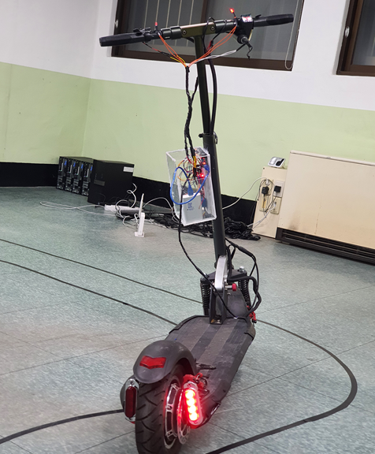

# 전동킥보드 방향지시등 개발

기술 스택:  
Arduino, C++

notion 링크:  
https://www.notion.so/23f86b77e264804ca94cf4ff5ba30885?source=copy_link

프로젝트 시작:  
2020년 9월 1일

마감 일자:  
2020년 10월 30일

인원:  
김덕현, 이승민, 양유현, 유수용, 김강태, 류광진

# 🎨디자인

---

# 🧠기획

---

## <기획 의도>

- 최대 25[km/h]의 속도로 등,하교 및 교내 이동수단으로 **전동킥보드의 사용이 증가**하고 있습니다.
**안전한 도로 주행을 위해서는 방향지시등이 필요**하지만, 판매중인 전동킥보드는 방향지시등이 부착된 제품이 없어 **사고 발생의 위험이 존재**한다. 따라서 본 과제는 **압력을 통한 방향지시등, 비상등을 부착하여 안전한 주행을 목표**로 하고 있습니다.

## **<도입효과>**

- **안전한 도로 주행 가능**
- **안전한 야간 주행 가능**

## <타겟>

- 전동킥보드 이용자
- 전동킥보드 업체

## <역할>

# 🏗️전체 구조

---

- 압력센서와 C++코딩을 통해 아두이노로 하드웨어와 연결

# 🛠️트러블 슈팅 및 회고록

---

## 전원 공급 문제

- 킥보드 본체에서 아두이노용 전력을 끌어오는 것이 불가능
- **원인 :** 킥보드 내부 전원 회로는 폐쇄적이고, 고장 가능성이나 보증 무효 이슈 있음
- **조치** : 아두이노와 LED 시스템 전원을 외부 보조 배터리로 대체하여 해결

## 물리적 제약 (설치 공간 문제)

- 킥보드 발판이 좁아 아두이노, 브레드보드 등 내장 불가능
- **원인** : 킥보드 설계는 휴대성과 최소 부피를 중시하여, 별도 기기 삽입을 고려한 여유 공간이 없음
- **조치**: 아두이노 및 배터리를 아크릴로 박스를 만들어 Frame에 설치, 향후에는 작은 보드 사용
